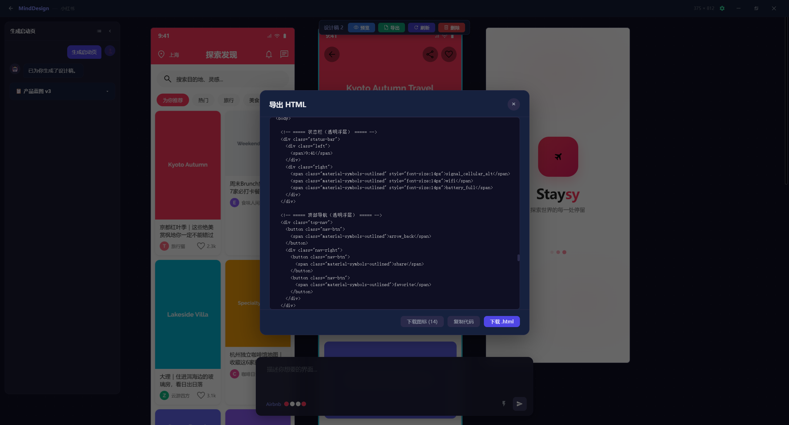
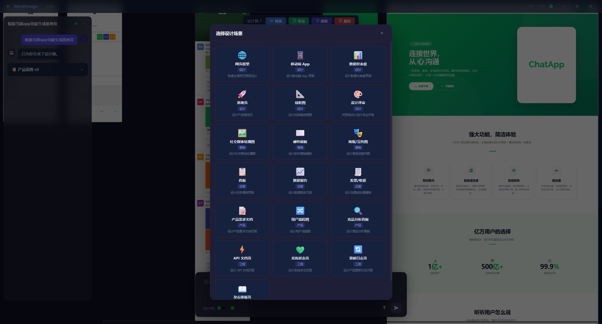

<div align="center">
  
  <h1>MindDesign</h1>
  <p>AI 对话式 UI 设计工具</p>
</div>

## 简介

MindDesign 是一款基于 AI 对话的 UI 设计工具。通过自然语言与 AI 交互，快速生成和编辑 UI 设计稿，支持多种页面类型、设计规范和配色方案，并支持导出 HTML。

## 截图

<p align="center">
  
</p>
<p align="center">
  
</p>
<p align="center">
  
</p>
<p align="center">
  
</p>
<p align="center">
  
</p>
<p align="center">
  
</p>
<p align="center">
  
</p>

## 功能特性

- **多模型支持** — 支持 OpenAI 兼容协议和 Claude 协议，可接入 OpenAI、DeepSeek、GLM、Claude 等多种大模型
- **AI 对话式设计** — 通过自然语言描述，AI 自动生成 UI 设计稿
- **可视化画布** — 基于 Leafer UI 的交互式画布，支持缩放、拖拽和元素编辑
- **设计规范系统** — 内置 50+ 套设计规范，支持按行业 / 标签 / 关键词筛选
- **视觉方向选择器** — 一键切换 Editorial Monocle / Modern Minimal / Warm Soft / Tech Utility / Brutalist 等 5 个方向
- **品牌资产自动提取** — 从 DesignSpec 派生 colors / typography / spacing / components / layout
- **品牌分析器** — 输入品牌 URL 或上传 Logo → 自动推断 DesignSpec
- **元素级局部修改** — 选中元素 → AI 仅修改该元素，不再重排整页
- **设计变体** — 一键生成 3 个变体（颜色 / 布局 / 文案），可采纳为正式画板
- **多画板 + 热区跳转** — 多页画板 + Alt 显示 hotspot，画板间点击跳转
- **多格式导出** — HTML / PNG（1x/2x/3x）/ PDF / ZIP（带资源）
- **代码片段导出** — Tailwind / CSS Variables / Vue 3 SFC / React 函数组件
- **真实图片数据源** — placehold.co / Unsplash 关键词 / 本地占位资源
- **自动质检** — DOM / Token / A11y 三类徽章，任意一项异常可一键"按规范修正"
- **设计版本与历史** — 每画板保留 20 个历史版本，支持回滚 / 对比 / 复制为变体
- **组件库化** — 选中元素可"另存为组件"，按 DesignSpec 分组，LLM 生成时优先使用
- **协作与分享** — 导出 `.mind` 分享包（去 LLM 配置），含预览页
- **全局快捷键** — `Cmd/Ctrl+K` 命令面板 / `N` 新建画板 / `E` 导出 / `/` 主题 / `P` 预览 / `S` 保存
- **桌面原生** — 剪贴板粘贴 / 拖拽图片 / Tauri & Wails 桥（运行时自动检测）
- **项目管理** — 创建、保存、自动保存、版本兼容（v1→v4 自动迁移）

## 技术栈

| 层级 | 技术 |
|------|------|
| 桌面框架 | [Wails v3](https://v3.wails.io/) (Go) |
| 前端框架 | Vue 3 + TypeScript |
| 画布引擎 | [Leafer UI](https://www.leaferjs.com/) |
| 状态管理 | Pinia |
| 构建工具 | Vite |

## 快速开始

### 环境要求

- Go 1.21+
- Node.js 18+
- [Wails v3 CLI](https://v3.wails.io/getting-started/installation/)

### 安装依赖

```bash
# 安装前端依赖
cd frontend
npm install
```

### 开发模式

```bash
wails3 dev
```

### 构建生产版本

```bash
wails3 build
```

## 开发流程

MindDesign 对"中等以上"的改动要求先写 spec，再写代码。

**触发条件（满足任一即强制）：**

- 单次 PR 涉及 ≥ 3 个文件
- 跨前后端 / 数据模型（Go + Vue/TS，或修改项目 JSON / DesignSpec / CanvasStore）
- 触及项目加载/保存链路（`project_service.go`、`canvasStore.ts` 等）

**完整规则与样例：**

- [docs/CONTRIBUTING.md](docs/CONTRIBUTING.md) — 改动分类、spec 流程、与 docs/ 的分工
- [.trae/specs/design-quality-optimization/spec.md](.trae/specs/design-quality-optimization/spec.md) — 当前最完整的 spec 样例

**三件套目录约定：**

```
.trae/specs/<change-id>/
├── spec.md        # Why / What / Impact / ADDED Requirements
├── tasks.md       # Phase × Task × SubTask
└── checklist.md   # 验收项（完成后 [ ] → [x]）
```

小修小补（typo、文案、配色微调、单个图标）不强制 spec。

## 项目结构

```
MindDesign/
├── main.go                 # Go 入口，Wails 应用配置
├── project_service.go      # 项目管理服务（文件读写、自动保存、最近项目）
├── project_service_test.go # 项目 v1→v4 迁移单测（8 个 case）
├── frontend/
│   ├── src/
│   │   ├── ai/             # AI 客户端与工具调用（含局部修改 / 变体 / 组件注入）
│   │   ├── canvas/         # 画布组件、Hotspot、版本时间线
│   │   ├── components/     # Vue 组件（聊天、工具栏、命令面板、导出、组件库、分享）
│   │   ├── composables/    # 全局快捷键 / 剪贴板图片
│   │   ├── prompts/        # AI 提示词 + DesignSpec v2 + 5 个视觉方向
│   │   ├── services/       # 数据源、native bridge
│   │   ├── stores/         # Pinia：canvas / autoSave / history / component / settings
│   │   ├── utils/          # exportHtml/Png/Pdf/Zip/Code + qaCheck + sharePackage
│   │   └── views/          # Home / Design 页面
│   ├── public/
│   │   ├── logo.png        # 应用 Logo
│   │   └── icons/          # SVG 图标库
│   └── package.json
├── screenshot/             # 应用截图
└── build/                  # 各平台构建配置
    ├── windows/
    ├── darwin/
    ├── linux/
    ├── android/
    └── ios/
```

## 测试

```bash
# 前端类型检查
cd frontend && npx vue-tsc --noEmit -p tsconfig.json

# 前端构建
cd frontend && npx vite build

# Go 单元测试
go test -v ./...
```

## 路线图

详见 [`.trae/specs/design-quality-optimization/tasks.md`](.trae/specs/design-quality-optimization/tasks.md)。
Phase 1-5 已全部交付（基础设施 / 设计系统深度 / 画布与产物 / 质量与协作 / 桌面原生）。

## 许可证

[Apache-2.0](LICENSE)
