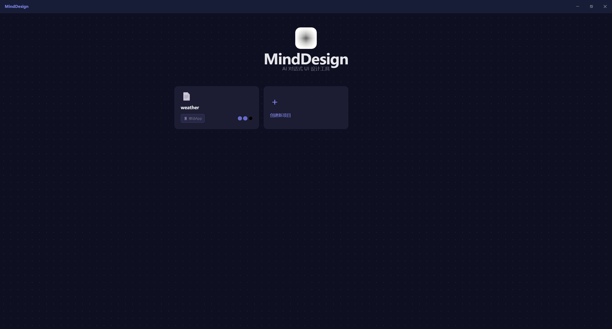
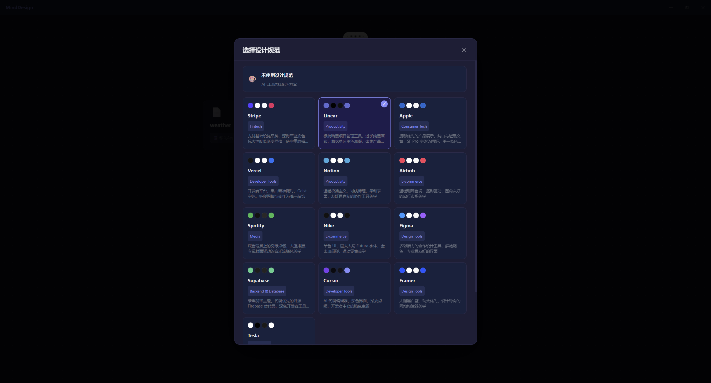
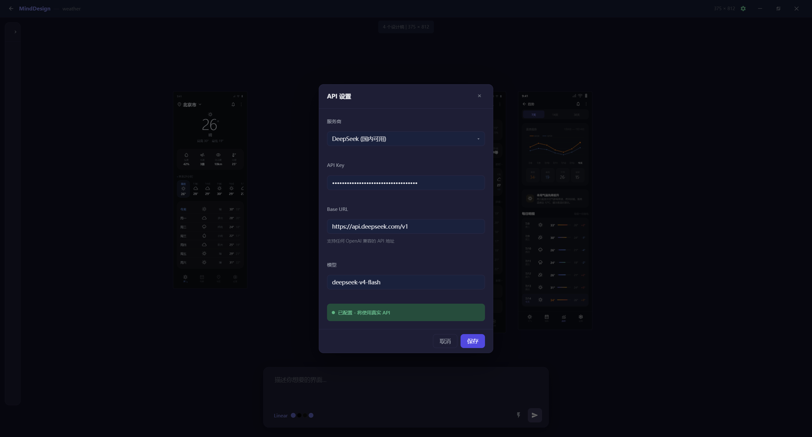
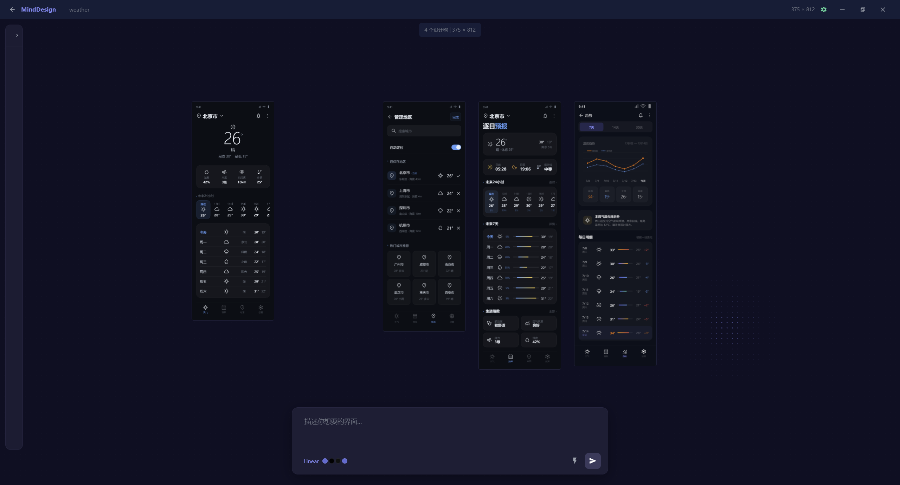
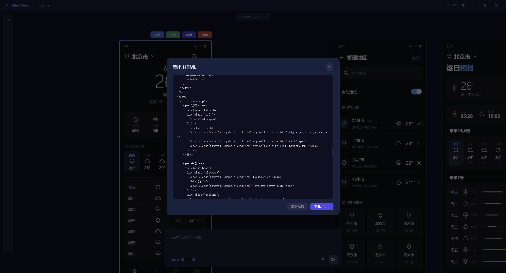

<div align="center">
  
  <h1>MindDesign</h1>
  <p>AI 对话式 UI 设计工具</p>
</div>

## 简介

MindDesign 是一款基于 AI 对话的 UI 设计工具。通过自然语言与 AI 交互，快速生成和编辑 UI 设计稿，支持多种页面类型、设计规范和配色方案，并支持导出 HTML。

## 截图

<p align="center">
  
</p>
<p align="center">
  
</p>
<p align="center">
  
</p>
<p align="center">
  
</p>
<p align="center">
  
</p>

## 功能特性

- **多模型支持** — 支持 OpenAI、DeepSeek、GLM 及自定义（OpenAI 兼容）等多种大模型
- **AI 对话式设计** — 通过自然语言描述，AI 自动生成 UI 设计稿
- **可视化画布** — 基于 Leafer UI 的交互式画布，支持缩放、拖拽和元素编辑
- **设计规范系统** — 内置多种设计规范，保持设计一致性
- **多种页面类型** — 支持不同类型的页面设计模板
- **配色方案** — 灵活的配色方案切换
- **项目管理** — 创建、保存、自动保存和最近项目记录
- **导出功能** — 将设计稿导出为 HTML

## 技术栈

| 层级 | 技术 |
|------|------|
| 桌面框架 | [Wails v3](https://v3.wails.io/) (Go) |
| 前端框架 | Vue 3 + TypeScript |
| 画布引擎 | [Leafer UI](https://www.leaferjs.com/) |
| 状态管理 | Pinia |
| 构建工具 | Vite |

## 快速开始

### 环境要求

- Go 1.21+
- Node.js 18+
- [Wails v3 CLI](https://v3.wails.io/getting-started/installation/)

### 安装依赖

```bash
# 安装前端依赖
cd frontend
npm install
```

### 开发模式

```bash
wails3 dev
```

### 构建生产版本

```bash
wails3 build
```

## 项目结构

```
MindDesign/
├── main.go                 # Go 入口，Wails 应用配置
├── project_service.go      # 项目管理服务（文件读写、自动保存、最近项目）
├── frontend/
│   ├── src/
│   │   ├── ai/             # AI 客户端与工具调用
│   │   ├── canvas/         # 画布组件与点阵网格
│   │   ├── components/     # Vue 组件（聊天面板、工具栏、导出对话框等）
│   │   ├── prompts/        # AI 提示词模板
│   │   ├── stores/         # Pinia 状态管理
│   │   ├── views/          # 页面视图
│   │   └── types/          # TypeScript 类型定义
│   ├── public/
│   │   ├── logo.png        # 应用 Logo
│   │   └── icons/          # SVG 图标库
│   └── package.json
├── screenshot/             # 应用截图
└── build/                  # 各平台构建配置
    ├── windows/
    ├── darwin/
    ├── linux/
    ├── android/
    └── ios/
```

## 许可证

[Apache-2.0](LICENSE)
